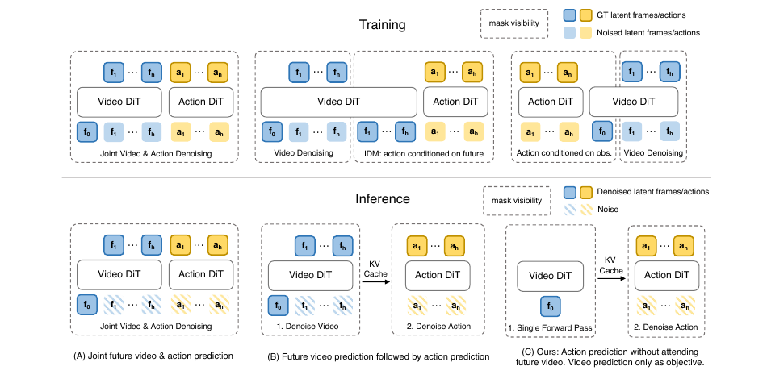
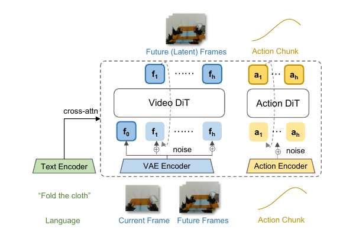
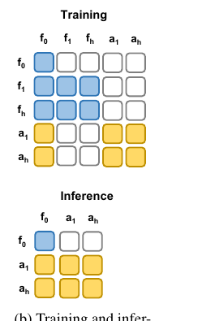
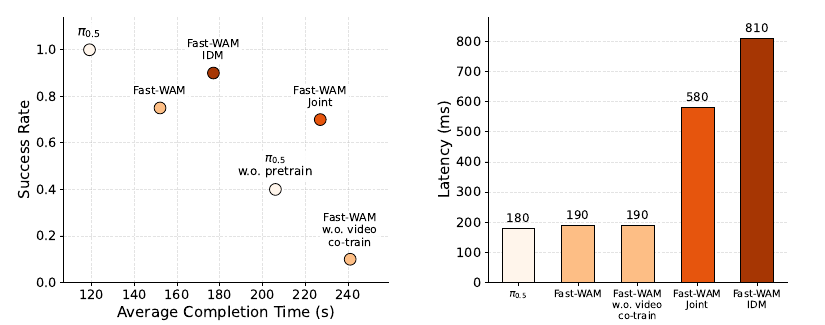

# 前沿算法2：Fast-WAM 世界动作模型复现与部署

本章介绍 Fast-WAM 的核心原理，并在 G2 Omnipicker 上完成三相机数据采集、LeRobot 数据转换、模型训练、推理服务和 Isaac Sim 闭环评测。阅读顺序与实践流程一致：先理解模型为什么能移除测试时未来想象，再完成 G2 数据、训练和部署。

> 论文：*Fast-WAM: Do World Action Models Need Test-time Future Imagination?*
>
> 作者：Tianyuan Yuan, Zibin Dong, Yicheng Liu, Hang Zhao
>
> 单位：清华大学交叉信息研究院（IIIS）、Galaxea AI
>
> 官方资源：[arXiv](https://arxiv.org/abs/2603.16666)｜[项目主页](https://yuantianyuan01.github.io/FastWAM/)｜[代码](https://github.com/yuantianyuan01/FastWAM)｜[模型权重](https://huggingface.co/yuanty/fastwam)

---

## 第一部分 算法原理

### 1.1 为什么要引入未来视频预测

标准视觉—语言—动作模型直接根据当前观测和语言预测一段动作：

$$
p(a_{1:H} \mid o, l)
$$

其中 $`o`$ 是当前观测，$`l`$ 是语言指令，$`a_{1:H}`$ 是长度为 $`H`$ 的动作块。这条路径推理直接，但动作监督不会显式要求视觉骨干理解接触、物体运动、遮挡和形变等动态变化。

World Action Model（WAM）把未来视觉预测作为额外学习目标，希望模型从演示数据中提取时间和动力学结构。常见的“先想象、再执行”方法可以写成：

$$
p(a_{1:H} \mid o, l)
= \int p(v_{1:T} \mid o, l)\,
p(a_{1:H} \mid o, l, v_{1:T})\,\mathrm{d}v_{1:T}
$$

这类方法在推理时先生成或同步生成未来视频，再预测动作。未来视频扩散需要处理高维时空 token，并执行多轮去噪，因而会增加闭环控制延迟。

这里需要区分两个问题：

- **视频共同训练是否有用**：未来视频监督能否让视觉骨干学到更好的世界表征；
- **测试时未来想象是否必要**：部署时是否必须显式生成未来视频，动作模型才能取得较好效果。

Fast-WAM 的核心结论是：主要收益来自训练阶段的视频共同训练。模型可以在训练时学习未来视频和动作，推理时只保留当前观测形成的世界表征：

$$
p_{\theta}(a_{1:H} \mid o, l)
= p_{\theta}(a_{1:H} \mid z(o, l))
$$

其中 $`z(o,l)`$ 是 Video DiT 根据当前观测和语言形成的潜在世界表征。它通过一次视频分支前向获得，不需要在线生成未来视频。

### 1.2 三种 WAM 范式



<p align="center"><em>图 1　联合式 WAM、因果式 WAM 与 Fast-WAM（图片来源：<a href="https://arxiv.org/abs/2603.16666">Fast-WAM 论文 Figure 1</a>）</em></p>

三种范式使用相同类型的当前观测、未来视频和动作 token，但信息依赖关系不同：

- **联合式 WAM（Joint WAM）**：未来视频和动作在同一个扩散过程中同步去噪，动作始终与视频生成绑定；
- **因果式 WAM（Causal WAM）**：Video DiT 先生成未来视频，Action DiT 再根据未来视频恢复动作，两个阶段串行执行；
- **Fast-WAM**：训练时仍预测未来视频，但 Attention Mask 禁止动作读取未来视频，推理时可以删除未来视频生成过程。

| 范式 | 训练时动作读取未来视频 | 推理时生成未来视频 | 推理顺序 |
|---|---:|---:|---|
| Joint WAM | 是 | 是 | 视频与动作同步去噪 |
| Causal WAM | 是 | 是 | 先视频、后动作 |
| Fast-WAM | 否 | 否 | 编码当前帧、再生成动作 |

Fast-WAM 并没有删除世界建模，而是把未来视频预测从部署时的必经步骤改成训练阶段的辅助监督。

### 1.3 模型结构与信息流



<p align="center"><em>图 2　语言、视频和动作经过各自编码器后进入 Video DiT 与 Action DiT 组成的 Mixture-of-Transformer（图片来源：<a href="https://arxiv.org/abs/2603.16666">Fast-WAM 论文 Figure 2a</a>）</em></p>

Fast-WAM 由约 5B 参数的 Wan2.2 Video DiT 和约 1B 参数的 Action DiT 组成，总规模约 6B：

- **语言指令**由 T5 编码，通过 cross-attention 注入视频和动作分支；
- **当前帧和未来帧**由 Wan2.2 视频 VAE 压缩为 latent token；
- **动作块**由轻量 Action Encoder 投影为与 DiT 对齐的动作 token。

视频 VAE 在空间上压缩 8×8、时间上压缩 4 倍，使 Video DiT 在潜空间而不是像素空间中建模。Fast-WAM 推理时只使用 VAE 编码器压缩当前帧，不需要把未来 latent 解码为可见视频。

训练输入包含三组 token：

1. 当前观测的干净 latent $`f_0`$，作为两个分支共享的条件；
2. 加噪的未来视频 latent $`f_1,\ldots,f_h`$，用于学习视频去噪；
3. 加噪的动作 token $`a_1,\ldots,a_h`$，用于学习动作去噪。



<p align="center"><em>图 3　结构化 Attention Mask 控制当前帧、未来视频和动作之间的信息流（图片来源：<a href="https://arxiv.org/abs/2603.16666">Fast-WAM 论文 Figure 2b</a>）</em></p>

结构化 Attention Mask 规定：

- 当前帧 token 不读取未来视频或动作 token；
- 未来视频 token 可以读取当前帧，并在视频分支内部双向注意；
- 动作 token 可以读取当前帧，并在动作分支内部双向注意；
- 动作 token 不能读取未来视频 token。

最后一条约束避免了未来信息泄漏。动作分支从训练开始就只依赖部署阶段真实可用的信息，因此推理时可以完整移除未来视频 token。

### 1.4 视频共同训练与训练目标

对动作或未来视频 latent，统一记监督目标为 $`y`$。采样高斯噪声 $`\epsilon \sim \mathcal{N}(0,I)`$ 和时间 $`t\in(0,1)`$：

$$
y_t = (1-t)y+t\epsilon
$$

模型学习从数据到噪声的 flow matching 速度场：

$$
\mathcal{L}_{\mathrm{FM}}(y)
= \mathbb{E}_{y,\epsilon,t}
\left[\left\lVert
f_{\theta}(y_t,t,o,l)-(\epsilon-y)
\right\rVert_2^2\right]
$$

动作和视频分别对应：

$$
\mathcal{L}_{\mathrm{act}}=\mathcal{L}_{\mathrm{FM}}(a_{1:H}),
\qquad
\mathcal{L}_{\mathrm{vid}}=\mathcal{L}_{\mathrm{FM}}(z_{1:T})
$$

总损失为：

$$
\mathcal{L}=\mathcal{L}_{\mathrm{act}}
+\lambda\mathcal{L}_{\mathrm{vid}}
$$

当 $`\lambda=1`$ 时，未来视频预测作为辅助监督约束 Video DiT 学习运动和交互相关表征；当 $`\lambda=0`$ 时，只优化动作损失，可用于验证视频共同训练的贡献。

### 1.5 训练与推理流程

| 阶段/模式 | Video DiT | Action DiT | 是否生成未来视频 |
|---|---|---|---:|
| 训练 | 学习当前帧与未来视频表征 | 学习动作去噪 | 是 |
| Action-only 推理 | 当前帧单次前向并写入 KV Cache | 10步动作去噪 | 否 |
| Joint 分析模式 | 未来视频迭代去噪 | 动作同步去噪 | 是 |

Action-only 是 Fast-WAM 的标准推理路径。“Single Forward Pass”只表示 Video DiT 对当前帧执行一次前向；Action DiT 仍需完成多步动作去噪。Joint 模式保留在本章代码中，用于分析同一个 checkpoint 生成的未来视频及其延迟开销。

### 1.6 论文实验结论

论文使用一致骨干比较四个受控变体，下面保留最能说明结论的平均结果：

| 方法 | 视频共同训练 | 测试时生成未来 | RoboTwin 2.0 | LIBERO | 真机延迟 |
|---|---:|---:|---:|---:|---:|
| Fast-WAM | 是 | 否 | **91.8** | 97.6 | **190 ms** |
| Fast-WAM-Joint | 是 | 是 | 90.6 | **98.5** | — |
| Fast-WAM-IDM | 是 | 是 | 91.3 | 98.0 | 810 ms |
| w/o video co-train | 否 | 否 | 83.8 | 93.5 | — |



<p align="center"><em>图 4　真机成功率、完成时间与推理延迟对比（图片来源：<a href="https://arxiv.org/abs/2603.16666">Fast-WAM 论文 Figure 4</a>）</em></p>

这些结果支持以下判断：

- 移除视频共同训练后，RoboTwin 和 LIBERO 平均成功率分别下降 8.0 和 4.1 个百分点；
- Fast-WAM 与 Joint、IDM 的任务性能接近，说明测试时显式生成未来并非当前实验中的主要收益来源；
- Fast-WAM-IDM 真机延迟约为 Fast-WAM 的 4.26 倍，未来视频扩散会明显降低闭环频率；
- 结论仍受骨干、数据和任务分布限制；对需要长时前瞻的任务，测试时未来想象是否有额外价值仍需单独验证。

## 第二部分 复现与部署

### 2.1 G2 任务与数据接口

#### 2.1.1 任务定义

任务沿用本教程的 G2 三色物块入盒场景：桌面放置红、绿、蓝三个物块和一个空盒，机器人根据语言指令抓取指定颜色并放入盒中。

```text
Pick up the red block and place it into the empty box.
Pick up the green block and place it into the empty box.
Pick up the blue block and place it into the empty box.
```

三种颜色共享模型和数据集，由语言指令区分目标。仿真场景、自动专家、成功判据和 16 维关节接口位于 `code/task_runtime/`。

#### 2.1.2 观测与动作空间

| 项目 | 取值 | 说明 |
|---|---|---|
| 相机 | `cam_head`、`cam_left_wrist`、`cam_right_wrist` | 三路同步 RGB，各 `240×320` |
| 状态 | 16 维 float32 | 左臂 7 + 右臂 7 + 左右夹爪 |
| 动作 | 16 维 float32 | 同一关节顺序下的绝对目标位置 |
| 采集频率 | 30 Hz | 物理仿真 120 Hz，每个动作含 4 个物理步 |
| 动作块 | 32 步 | 一次策略调用的输出形状为 `[32,16]` |
| 闭环执行 | 前 24 步 | 执行后重新观测并规划 |
| 视频块 | 9 帧 | `t+0,t+4,…,t+32` |

#### 2.1.3 三相机如何组成模型输入

Fast-WAM 沿用官方 RoboTwin 三相机拼接方式：头部图像放在上方，两个腕部图像放在下方。

```text
        320 px
┌──────────────────┐
│                  │
│   Head Camera    │ 256 px
│                  │
├─────────┬────────┤
│  Left   │ Right  │ 128 px
│  Wrist  │ Wrist  │
└─────────┴────────┘
       总高 384 px
```

单个模型视频帧为 `320×384`（宽×高）。9 帧是9个未来时刻，每个时刻都包含完整的三个视角，并非每个相机分别生成9帧。

#### 2.1.4 原始轨迹与 LeRobot 数据

采集脚本把每条轨迹保存为 NPZ，转换脚本再写入 LeRobot 2.1：

| NPZ 字段 | 形状/类型 | LeRobot 特征 |
|---|---|---|
| `head_image` | `[T,240,320,3]` uint8 | `observation.images.cam_head` |
| `left_image` | `[T,240,320,3]` uint8 | `observation.images.cam_left_wrist` |
| `right_image` | `[T,240,320,3]` uint8 | `observation.images.cam_right_wrist` |
| `qpos` | `[T,16]` float32 | `observation.state` |
| `command` | `[T,16]` float32 | `action` |
| `instruction` | 字符串 | `task` |
| `success` | bool | 仅成功轨迹进入训练集 |
| `raw_fps` | 30 | 数据集 `fps` |

转换前会检查轨迹长度、图像形状、频率、字段完整性和数值有限性。少于33帧的轨迹不能形成一个完整训练窗口，会被拒绝。

### 2.2 代码与环境配置

#### 2.2.1 项目目录

```text
前沿算法2-Fast-WAM/
├── docs/
│   ├── Fast-WAM 世界动作模型复现与部署.md
│   └── assets/                     # 论文插图与精选执行视频
└── code/
    ├── README.md
    ├── configs/                    # G2 数据与训练配置
    ├── task_runtime/               # G2 Isaac Sim 任务
    ├── tests/                      # 离线数据合同测试
    ├── collect_data.py
    ├── convert_dataset.py
    ├── inspect_data.py
    ├── fastwam_runtime.py
    ├── serve_policy.py
    ├── evaluate.py
    ├── summarize_latency.py
    ├── setup_env.sh
    ├── download_weights.sh
    ├── precompute_text.sh
    ├── train.sh                  # 8卡全量微调
    ├── train_lora.sh             # 单卡 LoRA 微调
    ├── lora.py                   # LoRA 注入与 int8 基座
    └── merge_lora.py             # 合并部署权重
```

官方 Fast-WAM 仓库、数据、预训练权重、训练 checkpoint 和评测输出均为运行时产物，由 `.gitignore` 排除，不随教程保存。

#### 2.2.2 准备仿真资产与模型环境

本章已验证的环境为 Linux、NVIDIA GPU 和 Isaac Sim 5.1.0；模型端使用 Python 3.10、PyTorch 2.7.1 和 CUDA 12.8。Joint 模式如需保存预测视频，系统还需要 `ffmpeg`。

数据采集与闭环评测使用 IsaacLab 自带的 Python。首次打开终端时，先将 `ISAACLAB_ROOT` 指向本机 IsaacLab 仓库根目录，并确认解释器存在：

```bash
export ISAACLAB_ROOT="$HOME/IsaacLab"  # 按实际安装位置修改
test -x "$ISAACLAB_ROOT/_isaac_sim/python.sh"
```

后文的 `${ISAACLAB_ROOT}/_isaac_sim/python.sh` 均引用这个解释器；模型训练与推理服务仍使用独立的 `fastwam` Conda 环境。

G2 USD 不随 GitHub 代码仓库分发。先在 `hello-robotics` 根目录下载本章所需的最小资产集：

```bash
python -m pip install -U huggingface_hub
hf download Datawhale/g2_assets \
  --repo-type dataset \
  --revision df7aae7e160f0eeabb2ebc88a3a396405f4a5aee \
  --include "assets/robot/G2_omnipicker/**" \
  --local-dir code
test -f code/assets/robot/G2_omnipicker/robot.usda
```

资产来源为 [Datawhale/g2_assets](https://huggingface.co/datasets/Datawhale/g2_assets)。如果已在其他位置保存完整资产，可设置 `G2_ASSETS_ROOT` 指向其 `assets` 目录。

然后进入本章代码目录，克隆并固定官方 Fast-WAM 版本：

```bash
cd sota_algorithm/g2/前沿算法2-Fast-WAM/code
git clone https://github.com/yuantianyuan01/FastWAM.git FastWAM
git -C FastWAM checkout 7faa71108368fbb3b6885649f112af607427a2d4
bash setup_env.sh
conda activate fastwam
```

`setup_env.sh` 创建或复用名为 `fastwam` 的 Python 3.10 环境，安装 PyTorch 2.7.1、Fast-WAM、LeRobot 2.1 写入器和离线测试依赖。Isaac Sim 仍使用教程现有的仿真环境，不与模型环境混装。

#### 2.2.3 接入 G2 配置与运行目录

官方 Fast-WAM 训练脚本以 `FastWAM/` 为工作目录，只会按官方约定从 `FastWAM/configs`、`FastWAM/data` 和 `FastWAM/checkpoints` 查找配置、数据与初始权重。本教程则把 G2 任务代码和运行产物放在章节目录中，便于单独管理，因此需要在两种目录结构之间建立连接。

`link_dirs.sh` 会接入 G2 数据与训练配置、安装可选的 LoRA 扩展，并创建两个软链接：

```text
FastWAM/data        -> code/data
FastWAM/checkpoints -> code/checkpoints
```

软链接只是路径指向，不会复制数据或额外占用一份磁盘空间。脚本可重复运行；如果目标位置已存在普通目录，它会保留原目录并输出警告，不会覆盖。

训练、权重准备和文本缓存脚本都会自动调用 `link_dirs.sh`，通常无需手动执行。如需提前检查目录状态，可以单独运行：

```bash
bash link_dirs.sh
python -m pytest tests -q
```

`link_dirs.sh` 会校验 Fast-WAM commit；版本不一致时会直接停止，避免在未验证的上游接口上训练。

#### 2.2.4 准备模型权重

```bash
conda activate fastwam
bash download_weights.sh
```

本步准备两部分权重：

- Wan2.2-TI2V-5B 视频骨干，位于 `code/weights/`；
- 由视频骨干插值得到的 Action DiT 初始化权重，位于 `code/checkpoints/`。

Action DiT 插值在 CPU 上执行，避免同时把完整视频骨干载入小显存 GPU。已有 Wan2.2 权重时可以用软链接复用。

### 2.3 数据采集与处理

#### 2.3.1 采集专家轨迹

先只查看采集配额：

```bash
${ISAACLAB_ROOT}/_isaac_sim/python.sh collect_data.py --plan-only
```

正式采集默认包含150条 clean 和1500条 randomized 成功轨迹，并按红、绿、蓝均衡分配：

```bash
${ISAACLAB_ROOT}/_isaac_sim/python.sh collect_data.py --headless
```

小规模验证可指定配额：

```bash
${ISAACLAB_ROOT}/_isaac_sim/python.sh collect_data.py \
  --clean-total 30 --randomized-total 60 --headless
```

采集支持断点续跑。失败轨迹会保留用于诊断，但转换时只接收成功且满足数据合同的轨迹。

#### 2.3.2 转换并检查数据

```bash
conda activate fastwam
python convert_dataset.py
python inspect_data.py
python inspect_data.py --lerobot data/lerobot/g2_pick_block_lerobot
```

正式数据在官方读取器中的有效窗口为：

| 划分 | 样本窗口数 |
|---|---:|
| train | 377,223 |
| val | 3,927 |

单个样本的视频形状为 `[3,9,384,320]`，动作与状态分别为 `[32,16]`，文本缓存形状为 `[128,4096]`。

#### 2.3.3 预计算文本表征

```bash
conda activate fastwam
bash precompute_text.sh
```

训练和部署均复用三条指令的 T5 context。推理服务默认读取预计算 context，避免 T5 与约6B参数的策略同时占用显存。

### 2.4 模型训练

#### 2.4.1 训练目标选择

Fast-WAM 始终学习动作预测，本章提供两种训练目标：

| 训练目标 | 视频损失权重 |
|---|---:|
| 加视频损失 | `lambda_video=1` |
| 不加视频损失 | `lambda_video=0` |

视频损失是训练阶段的辅助监督。开启后，模型在学习动作的同时，还通过未来帧学习场景的运动和交互变化；关闭后，模型结构、训练数据和动作目标都不变，只移除这项辅助监督，作为消融对照。

两种训练目标不需要分别维护脚本或配置文件，运行时直接通过 `model.loss.lambda_video` 参数切换。

#### 2.4.2 全量微调

本章的正式实验采用8卡全量微调。下面依次说明参数更新范围、训练参数配置和启动方法。

**参数更新范围。**

全量微调会更新 MoT 和 G2 状态编码模块中的全部可训练参数：

| 模块 | 训练状态 |
|---|---|
| Video Expert | 全量更新 |
| Action Expert | 全量更新 |
| G2 proprio encoder | 全量更新 |
| 视频 VAE | 冻结 |
| T5 文本编码器 | 不加载，使用预计算文本表征 |

Video Expert 和 Action Expert 的注意力层、FFN 与归一化层都会参与训练，Action Expert 的动作输入输出层也会更新。可训练参数总数为 `6,020,761,808`。

**训练配置与启动。**

配置文件为 `configs/task/g2_uncond_3cam384_1e-4.yaml`，正式训练参数如下：

| 配置项 | 数值 |
|---|---:|
| GPU | 8×80GB |
| 每卡 batch | 8 |
| 梯度累积 | 2 |
| 有效全局 batch | 128 |
| 训练精度 | bf16 |
| 分布式策略 | DeepSpeed ZeRO-1 |
| 优化步 | 7,500 |
| 学习率 | `1e-4` |
| 学习率计划 | cosine |
| warmup | 375 step |
| 验证间隔 | 500 step |
| 保存间隔 | 2500 step |

正式训练前，先接入 G2 配置并运行 dryrun：

```bash
bash link_dirs.sh
cd FastWAM
python scripts/dryrun_fastwam.py task=g2_uncond_3cam384_1e-4
cd ..
```

根据 2.4.1 节选择训练目标：

```bash
# 加视频损失
bash train.sh 8 model.loss.lambda_video=1

# 不加视频损失
bash train.sh 8 model.loss.lambda_video=0
```

两种训练目标除视频损失权重外，其余训练参数完全一致。训练完成后，部署需要以下两个配套文件：

```text
FastWAM/runs/<run>/
├── checkpoints/weights/step_007500.pt
└── dataset_stats.json
```

权重和 `dataset_stats.json` 必须来自同一个 run。

#### 2.4.3 LoRA 微调

LoRA 是没有多卡资源时的备选方案。它在双 expert 的注意力和 FFN 线性层中加入 rank-16 适配器，完整训练 Action Expert 的动作输入输出层和 G2 状态编码器，并用 int8 保存冻结基座以降低显存占用。

| 配置项 | 数值 |
|---|---:|
| GPU | 1×24GB |
| batch | 1 |
| LoRA rank / alpha | 16 / 32 |
| LoRA dropout | 0 |
| 冻结基座 | int8 per-output-channel |
| 优化步 | 50,000 |
| 学习率 | `1e-4` cosine |
| 验证/保存间隔 | 1000 / 5000 step |

`link_dirs.sh` 会自动接入 LoRA 模块和 trainer 补丁。选择训练目标后启动单卡训练：

```bash
# 加视频损失
bash train_lora.sh model.loss.lambda_video=1

# 不加视频损失
bash train_lora.sh model.loss.lambda_video=0
```

LoRA checkpoint 在部署前需要合并为普通 bf16 权重：

```bash
python merge_lora.py \
  --checkpoint FastWAM/runs/<run>/checkpoints/weights/step_050000.pt \
  --output FastWAM/runs/<run>/checkpoints/weights/step_050000_merged.pt \
  --rank 16 --alpha 32
```

合并后的 checkpoint 可以直接交给 `serve_policy.py`，同时仍需使用同一 run 的 `dataset_stats.json`。LoRA 仅作为低显存训练路径，不参与后文实验指标对比。

### 2.5 模型推理与闭环评测

#### 2.5.1 推理模式选择

Fast-WAM 提供两种推理模式：

| 推理模式 | 参数 | 模型输出 |
|---|---|---|
| Action-only | `--inference-mode action` | 32步 Action Chunk，形状为 `[32,16]` |
| Joint | `--inference-mode joint` | 32步 Action Chunk和9帧预测视频 |

两种模式使用相同的 checkpoint 和当前三视角观测。Action-only 只计算动作；Joint 在计算动作的同时生成未来视频。后文的 Joint 可视化使用加视频损失训练的模型。

#### 2.5.2 启动推理服务

Action-only 模式：

```bash
conda activate fastwam
python serve_policy.py \
  --checkpoint FastWAM/runs/<run>/checkpoints/weights/step_007500.pt \
  --dataset-stats FastWAM/runs/<run>/dataset_stats.json \
  --inference-mode action \
  --measure-model-latency \
  --host 127.0.0.1 --port 8622 \
  2>&1 | tee results/latency_action.log
```

Joint 模式需要把 `--inference-mode` 改为 `joint`；如需保存预测视频，可同时加入保存参数：

```bash
python serve_policy.py \
  --checkpoint FastWAM/runs/<run>/checkpoints/weights/step_007500.pt \
  --dataset-stats FastWAM/runs/<run>/dataset_stats.json \
  --inference-mode joint \
  --measure-model-latency \
  --save-predicted-video-dir results/predicted \
  --save-predicted-video-limit-per-prompt 20 \
  --host 127.0.0.1 --port 8623 \
  2>&1 | tee results/latency_joint.log
```

模型服务与 Isaac Sim 通过 NumPy-over-TCP 协议通信，两端可以使用不同的 Python 环境，也可以分别部署在远程 GPU 机器和本地仿真机器上。分机部署时，服务端改用 `--host 0.0.0.0`，评测端的 `--host` 填写模型服务器地址。

`--measure-model-latency` 会记录每次 Action Chunk 的模型推理时间。完成闭环评测后，丢弃前5次预热并计算算术平均值：

```bash
python summarize_latency.py results/latency_action.log \
  --mode action --warmup 5
# mode=action warmup=5 samples=49 mean_ms_per_chunk=326.8

python summarize_latency.py results/latency_joint.log \
  --mode joint --warmup 5
# mode=joint warmup=5 samples=1379 mean_ms_per_chunk=687.1
```

计时前后均执行 `torch.cuda.synchronize()`。Action-only 统计 `infer_action()`，Joint 统计包含视频生成的 `infer_joint()`；两者均不包含 RPC 通信、图像预处理、动作反归一化、仿真和动作执行。

#### 2.5.3 闭环评测

本章采用统一的 RGB 扩大评测协议：

| 配置项 | 数值 |
|---|---:|
| 颜色 | 红、绿、蓝 |
| 每种颜色 | 50集 |
| 位置扰动 | ±0.01m |
| 单次预测 | 32步动作 |
| 单次执行 | 前24步 |
| 最大重规划 | 20次 |
| 推理期间 | 暂停仿真 |

启动任一种推理服务后，在 Isaac Sim 环境中运行：

```bash
${ISAACLAB_ROOT}/_isaac_sim/python.sh evaluate.py \
  --host 127.0.0.1 --port 8622 \
  --colors red green blue \
  --episodes-per-color 50 \
  --execute-steps 24 \
  --action-seconds 0.03333333333333333 \
  --position-noise 0.01 \
  --max-replans 20 \
  --pause-during-inference \
  --headless \
  --output results/eval_rgb50.json
```

评测端每执行24步就重新获取三视角观测并请求下一个 Action Chunk。测试 Joint 服务时，将端口改为该服务使用的端口。

#### 2.5.4 实验结果

**试验指标。**

以下结果均来自 step7500，并使用 2.5.3 节的同一评测协议。

**推理模式对比：固定加视频损失**

| 推理模式 | 红色 | 绿色 | 蓝色 | 总成功率 | 平均延迟（ms/chunk） |
|---|---:|---:|---:|---:|---:|
| Action-only | 50/50 | 48/50 | 44/50 | 142/150（94.7%） | 326.8 |
| Joint | 50/50 | 46/50 | 46/50 | 142/150（94.7%） | 687.1 |

Action-only 与 Joint 的总成功率相同，Joint 的单次延迟约为 Action-only 的2.10倍。延迟按 2.5.2 节的方法在单张 NVIDIA H100 80GB 上测量，模型使用 BF16、10次去噪和 eager 模式。

**训练目标对比：固定 Action-only 推理**

| 训练目标 | 红色 | 绿色 | 蓝色 | 总成功率 |
|---|---:|---:|---:|---:|
| 加视频损失 | 50/50 | 48/50 | 44/50 | 142/150（94.7%） |
| 不加视频损失 | 49/50 | 46/50 | 42/50 | 137/150（91.3%） |

在本次 150 集评测中，加视频损失的模型总成功率高 3.3 个百分点。该结果用于比较本章两种训练目标，不作为统计显著性结论。

**可视化。**

下面是 step7500 Action-only 模式的一次成功执行。模型只输出动作，画面按照头部相机在上、两个腕部相机在下的方式排列。动画保持原始速度，完整时长为 31.3 秒。


下面是 step7500 Joint 模式的一次成功执行。左侧为真实三视角，右侧为同一次推理生成的未来三视角。动画保持原始速度，完整时长为 31.3 秒。


## 参考文献与延伸阅读

- Fast-WAM：[论文](https://arxiv.org/abs/2603.16666)｜[项目主页](https://yuantianyuan01.github.io/FastWAM/)｜[官方代码](https://github.com/yuantianyuan01/FastWAM)｜[模型权重](https://huggingface.co/yuanty/fastwam)
- Wan2.2 视频骨干：[官方代码](https://github.com/Wan-Video/Wan2.2)
- Motus：[论文](https://arxiv.org/abs/2512.13030)
- LIBERO：[论文](https://arxiv.org/abs/2306.03310)｜[代码](https://github.com/Lifelong-Robot-Learning/LIBERO)
- RoboTwin 2.0：[代码](https://github.com/RoboTwin-Platform/RoboTwin)
