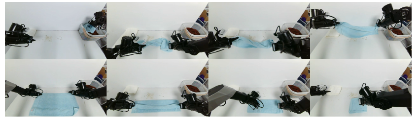

# Fast-WAM 模型原理

> 配套实践：[Fast-WAM 复现与部署](./Fast-WAM%20复现与部署.md)

> 论文：*Fast-WAM: Do World Action Models Need Test-time Future Imagination?*
>
> 作者：Tianyuan Yuan, Zibin Dong, Yicheng Liu, Hang Zhao
>
> 单位：清华大学交叉信息研究院（IIIS）、Galaxea AI
>
> 版本：arXiv:2603.16666v2，2026-03-23，CC BY 4.0
>
> 官方页面：[arXiv](https://arxiv.org/abs/2603.16666)｜[项目主页](https://yuantianyuan01.github.io/FastWAM/)｜[代码](https://github.com/yuantianyuan01/FastWAM)

## 1. 一句话结论

Fast-WAM 的核心发现是：**World Action Model（WAM）的主要收益可能来自训练阶段的视频预测辅助任务，而不是测试阶段真的生成未来视频。** 因此，训练时保留视频—动作联合学习，推理时删除未来视频扩散分支，只用当前观测形成的世界表征预测动作，可以在基本保持性能的同时显著降低延迟。

这篇论文真正回答的不是“视频预测是否有用”，而是把下面两个经常被绑定在一起的因素拆开：

1. 训练时用未来视频预测作为辅助监督，是否能学到更好的世界表征；
2. 推理时显式生成未来视频，是否是动作性能所必需的。

实验表明第 1 点成立，但并未证明第 2 点在所有任务中全然无用。

## 2. 研究问题与动机

### 2.1 从 VLA 到 WAM：为什么要预测未来

标准视觉—语言—动作（Vision-Language-Action, VLA）策略直接建模：

$$
p(a_{1:H} \mid o, l)
$$

其中 $o$ 是当前观测，$l$ 是语言指令，$a_{1:H}$ 是长度为 $H$ 的动作块。

这种直接策略的优点是推理链路短：模型看到当前图像和指令后，直接输出接下来的一段动作。不过，仅靠动作监督并不会显式要求视觉骨干解释“执行动作后世界将怎样变化”。对于涉及接触、物体运动、遮挡或可变形物体的任务，策略不仅需要识别“眼前有什么”，还需要形成关于物理变化和时间结构的内部表征。

World Action Model（WAM）因此把未来视觉预测引入机器人策略学习。它希望模型在学习动作的同时，也学习观测随交互演化的规律。与主要依赖静态图文语义先验的直接 VLA 相比，未来视频预测为模型增加了运动和交互层面的监督：若模型要预测物体之后的位置、形变或接触结果，就必须从训练数据中提取一部分动力学结构。

这里需要区分两个概念：

- **世界建模能力**：模型内部是否学到了与环境变化相关的表征；
- **显式未来想象**：推理时是否真的生成一段可见或潜空间中的未来视频。

前者是模型学到了什么，后者是部署时采用怎样的计算过程。二者相关，但不必然等价。

### 2.2 “先想象、再执行”的直觉与代价

许多 WAM 采用“先想象、再执行”（imagine-then-execute）的概率分解：

$$
p(a_{1:H} \mid o, l)
= \int p(v_{1:T} \mid o, l)\,
p(a_{1:H} \mid o, l, v_{1:T})\,\mathrm{d}v_{1:T}
$$

其中 $v_{1:T}$ 表示预测时域 $T$ 内的未来视觉观测。简单来说，这个公式表示模型要综合考虑各种可能的未来，再决定采取什么动作；实际系统不会真的计算所有未来，通常只生成一个或少数几个未来视频，再据此预测动作。直观上，这种分解很像人类“先在脑中预演，再执行动作”：模型先预测任务成功时视觉世界可能怎样演化，再根据想象出的未来决定动作。常见实现有两类：

1. **联合式 WAM（Joint WAM）**：未来视频 token 和动作 token 在同一个生成过程中共同去噪；
2. **因果式 WAM（Causal WAM）**：先生成未来视频，再由逆动力学模型（IDM）或动作头根据视觉变化恢复动作。

这条路径的问题主要在计算成本。视频扩散处理的是高维时空 token，通常需要多轮去噪；如果动作预测还必须等待未来视频完成，两个阶段又形成串行依赖。对于闭环控制，策略需要在每个重规划时刻重新推理，这类延迟会直接限制控制频率。论文后续实验中，Fast-WAM 的单次推理延迟为 190 ms，而显式“先视频、后动作”的 Fast-WAM-IDM 为 810 ms，说明这不是可以忽略的常数开销。

### 2.3 现有研究中的关键混杂因素

过去许多 WAM 同时做了两件事：

1. **训练阶段**加入未来视频预测目标，让视觉骨干学习物理和时间结构；
2. **推理阶段**显式生成未来视频，再让动作预测依赖这些未来表示。

如果这样的模型优于普通 VLA，我们无法直接判断收益究竟来自哪里。可能是训练时的视频监督塑造了更好的表征，也可能是推理时看到想象的未来确实提供了额外前瞻信息，还可能两者都重要。由于两个因素在同一个系统中同时出现，单纯比较“WAM 对 VLA”无法回答这个机制问题。

可以把论文要区分的两种假设写成：

- **训练表征假设**：视频共同训练（video co-training）是主要收益来源。它迫使视频骨干学习运动、接触和任务相关的时间结构；只要这些表征保留下来，推理时不生成未来视频也能得到强动作策略。
- **推理前瞻假设**：显式未来想象本身不可替代。动作模型需要读取生成的未来轨迹才能获得明显增益；删除未来生成后，即便训练时仍预测视频，性能也应显著下降。

二者给出了不同的可检验预期：

| 对照结果 | 更支持的解释 |
|---|---|
| Fast-WAM 接近 Fast-WAM-Joint 和 Fast-WAM-IDM，但去掉视频共同训练后明显变差 | 训练表征假设 |
| Fast-WAM 明显落后于 Fast-WAM-Joint 和 Fast-WAM-IDM | 推理前瞻假设 |
| 两种删除都造成明显下降 | 训练监督和测试时想象都重要 |

论文实际观察到第一种模式，因此把主要收益归因于训练时的视频共同训练。不过，这是一项基于当前骨干、数据规模和任务分布的经验结论，不等于证明显式未来想象在所有长时规划任务中都没有价值。

### 2.4 Fast-WAM 的解题思路

Fast-WAM 的目标不是删除世界建模，而是把它从“必须在线执行的生成过程”改成“训练阶段塑造表征的辅助任务”。训练时，模型仍同时学习未来视频和动作；推理时，则直接建模：

$$
p_{\theta}(a_{1:H} \mid o, l)
= p_{\theta}(a_{1:H} \mid z(o, l))
$$

这里 $z(o, l)$ 是视频骨干根据当前观测和语言得到的潜在世界表征（latent world representation）。它通过一次视频分支编码获得，而不是通过多轮去噪采样未来观测。换句话说，Fast-WAM 把预训练 Video DiT 从“在线未来视频生成器”重新用作“世界表征编码器”。

为了让未来视频分支在部署时可以安全删除，训练时必须保证动作预测不读取未来视频 token，否则模型会依赖测试时不存在的信息。论文使用结构化注意力掩码完成这一隔离；其具体信息流在第 4 节展开。

## 3. 三种 WAM 范式

<em>图 1　(A) 联合式 WAM（Joint WAM），未来视频与动作联合去噪；(B) 因果式 WAM（Causal WAM），先生成未来视频，再用 IDM/动作头预测动作；(C) Fast-WAM，训练时保留视频预测，推理时仅编码当前帧并预测动作（图片来源：<a href="https://arxiv.org/abs/2603.16666">Fast-WAM 论文 Figure 1</a>）</em>

### 3.1 (A) 联合式 WAM（Joint WAM）

- **训练阶段**：输入包括当前帧 latent $f_0$、加噪的未来视频 token $f_1,\ldots,f_h$ 和加噪的动作 token $a_1,\ldots,a_h$。Video DiT 与 Action DiT 通过共享注意力交换信息，并分别以真实未来视频和真实动作为监督，学习对应的 flow matching 速度场。
- **推理阶段**：模型以 $f_0$ 为条件，让未来视频和动作同时从随机噪声出发，并在多轮扩散中联合去噪。两者没有明确的先后顺序，而是在同一过程中同步生成。
- **关键特点**：动作生成始终与未来视频生成绑定。即使部署时只需要动作，也不能省略视频去噪。论文中的受控实现为 `Fast-WAM-Joint`。
- **代表工作**：Motus（本教程第十六章有完整讲解与 G2 部署实践）是这一范式的典型代表——它由理解、视频、动作三个专家组成 MoT，每层通过联合注意力交换信息，推理时未来视频与动作从噪声同步去噪。也正因如此，它的推理延迟中包含了完整的视频扩散成本，这正是 Fast-WAM 想要消除的部分。

### 3.2 (B) 因果式 WAM（Causal WAM）

- **训练阶段**：Video DiT 根据 $f_0$ 和加噪的未来视频 token 学习视频去噪；Action DiT 则以未来视频表示为条件，学习动作去噪。图中画的是以真实未来视频为条件，实际的 `Fast-WAM-IDM` 还会以 $p=0.5$ 的概率对真实未来视频 token 加噪，使动作模型适应不完美的视频表示。
- **推理阶段**：Video DiT 先从随机噪声生成未来视频，并将其特征写入 `KV Cache`；Action DiT 随后读取这些未来特征，再从动作噪声生成动作。
- **关键特点**：视频和动作串行生成，动作必须等待未来视频去噪完成。论文中的受控实现为 `Fast-WAM-IDM`。

### 3.3 (C) Fast-WAM

- **训练阶段**：模型仍同时优化视频去噪和动作去噪目标，但注意力 mask 禁止动作 token 读取未来视频 token。两个分支都以当前帧 $f_0$ 为条件，视频预测负责塑造 Video DiT 的世界表征，动作预测则只使用部署时真实可得的信息。
- **推理阶段**：模型不再创建或去噪 $f_1,\ldots,f_h$。Video DiT 只对 $f_0$ 执行一次前向，得到当前观测的世界表征并写入 `KV Cache`；Action DiT 再以该表征为条件进行动作去噪。
- **关键特点**：未来视频预测只作为训练目标，不进入推理路径。`Single Forward Pass` 仅指 Video DiT 编码一次，Action DiT 仍需执行多步动作去噪。

### 3.4 三张图放在一起看

| 范式 | 训练时动作读取未来视频 | 推理时生成未来视频 | 推理顺序 | 论文中的受控实现 |
|---|---:|---:|---|---|
| (A) 联合式 WAM | 是 | 是 | 视频与动作同步去噪 | `Fast-WAM-Joint` |
| (B) 因果式 WAM | 是 | 是 | 先生成视频，再生成动作 | `Fast-WAM-IDM` |
| (C) Fast-WAM | 否 | 否 | 先编码当前帧，再生成动作 | `Fast-WAM` |

三者最本质的区别是：(A) 和 (B) 都把未来视频作为推理时的中间变量，只是一个联合生成、一个串行生成；(C) 则让动作从训练阶段开始就不依赖未来视频，因此推理时可以完整删除未来视频生成过程。

## 4. 模型结构

**概览。** Fast-WAM 的目标是保留视频建模在训练阶段带来的表征学习收益，同时消除推理阶段显式生成未来视频的成本。

<em>图 2a　语言、当前帧、未来视频帧和动作块经过各自的编码器后，送入由 Video DiT 与 Action DiT 组成的 Mixture-of-Transformer（MoT）（图片来源：<a href="https://arxiv.org/abs/2603.16666">Fast-WAM 论文 Figure 2a</a>）</em>

**输入与编码。**

- **语言指令**：由 Wan2.2 内置的 T5 文本编码器转换为语言特征。T5 是在大规模文本上预训练的编码器，负责把“把毛巾叠好”这类指令变成模型可用的语义向量。语言特征**不进入** self-attention 的 token 序列，而是通过 cross-attention 作为条件注入所有 token——这样视频和动作两个分支读到的是同一份任务语义，且语言长度变化不会干扰视觉 token 的排布；
- **视觉观测**：当前帧（训练时还有未来帧）由视频 VAE 压缩为低维视频 latent，避免 Video DiT 直接处理高维像素（VAE 的作用见下方标签）；
- **动作块**：由 Action Encoder 转换为动作 token。动作本身是低维连续向量（如各关节的目标位置），维度远小于视觉 latent，因此 Action Encoder 只需一个轻量映射（MLP）把长度为 $H$ 的动作块投影到与 DiT 对齐的维度——动作 token 由此获得与视频 token 相同的“表达方式”，才能参与共享注意力。

> **💡 背景知识：为什么需要视频 VAE**
>
> VAE（变分自编码器，Variational Autoencoder）由一对编码器和解码器组成：编码器把高维像素压缩成低维潜空间表示（latent），解码器再把它还原回像素。直接让 DiT 在像素空间做扩散是不可行的——一段视频动辄几十万像素，注意力计算量会爆炸；而潜空间表示把空间和时间维都大幅压缩（Wan2.2 的视频 VAE 空间维压缩 8×8、时间维压缩 4 倍），同时过滤掉像素级的冗余细节，保留语义和运动结构，DiT 只需在“浓缩”后的 token 序列上工作。这也是几乎所有现代视频生成模型（以及本教程第十六章的 Motus）的共同选择。
>
> Fast-WAM 复用的是 Wan2.2 自带的预训练视频 VAE，且推理时只用到它的**编码器**把当前帧压成 $f_0$——因为 Fast-WAM 不再需要把想象出的未来视频解码回像素画面给人看，解码器在部署时完全不参与。

**MoT 双分支。** Fast-WAM 使用预训练的 Wan2.2-5B Video DiT 作为视频分支，并新增约 1B 参数的 Action DiT 作为动作分支。两个分支组成共享注意力的 MoT，总模型规模约为 6B。Video DiT 负责视频建模，Action DiT 负责动作生成；两者能够读取哪些信息由结构化 attention mask 决定。

**训练信息流。** 编码后的输入分为三组：

1. 当前观测首帧的干净 latent token $f_0$，作为视频和动作分支共享的视觉条件；
2. 加噪的未来视频 latent token $f_1,\ldots,f_h$，只用于学习未来视频去噪；
3. 加噪的动作 token $a_1,\ldots,a_h$，用于学习动作去噪。

Video DiT 和 Action DiT 分别预测未来视频与动作对应的 flow matching 速度场；$f_0$ 只是共享条件，不需要预测。

<em>图 2b　结构化 mask 控制当前帧、未来视频和动作之间的信息流（图片来源：<a href="https://arxiv.org/abs/2603.16666">Fast-WAM 论文 Figure 2b</a>）</em>

为了防止未来信息泄漏，结构化 attention mask 规定：

- 在 MoT 的 self-attention 中，当前帧 token $f_0$ 不读取未来视频或动作 token；
- 未来视频 token 在视频分支内双向注意，并可以读取 $f_0$；
- 动作 token 在动作分支内双向注意，并可以读取 $f_0$；
- **动作 token 不能读取未来视频 token。**

因此，视频预测和动作预测共享当前观测与语言条件，但动作分支不会接触未来视频，避免依赖推理时不存在的信息。

**推理信息流。** 未来视频 token 和对应的去噪过程被整体移除，但 Video DiT 本身仍然保留：

1. 视频 VAE 将当前帧编码为 $f_0$；
2. Video DiT 只处理 $f_0$，通过一次前向得到潜在世界表征；
3. 视频侧特征写入 `KV Cache`，供后续动作去噪复用；
4. Action DiT 以该世界表征和语言指令为条件，从动作噪声出发，迭代生成动作块。

**容易误读之处：** 论文所说的 “single forward pass” 是指视频表征只计算一次。动作仍采用 10 个去噪步，所以整个策略并非只有一次 Transformer 前向。

## 5. 训练目标

对动作或未来视频 latent，统一记目标为 $y$。这里的符号与第 3、4 节对应：$y = a_{1:H}$ 即动作 token $a_1,\ldots,a_h$ 对应的动作块，$y = z_{1:T}$ 即未来视频帧经 VAE 编码后的 latent（也就是图中加噪的 $f_1,\ldots,f_h$ 所对应的监督目标）。采样高斯噪声 $\epsilon \sim \mathcal{N}(0, I)$ 和时间 $t \in (0, 1)$：

$$
y_t = (1 - t)y + t\epsilon
$$

模型预测从数据到噪声的速度场：

$$
\mathcal{L}_{\mathrm{FM}}(y)
= \mathbb{E}_{y,\epsilon,t}
\left[\left\lVert
f_{\theta}(y_t, t, o, l) - (\epsilon - y)
\right\rVert_2^2\right]
$$

分别得到：

$$
\mathcal{L}_{\mathrm{act}} = \mathcal{L}_{\mathrm{FM}}(a_{1:H}),
\qquad
\mathcal{L}_{\mathrm{vid}} = \mathcal{L}_{\mathrm{FM}}(z_{1:T})
$$

总损失为：

$$
\mathcal{L} = \mathcal{L}_{\mathrm{act}}
+ \lambda\mathcal{L}_{\mathrm{vid}}
$$

这里 $\mathcal{L}_{\mathrm{vid}}$ 的价值不是让推理必须输出视频，而是通过预测未来 latent 约束视觉骨干学习动力学相关表征。

## 6. 控制变量设计

| 变体 | 视频共同训练 | 测试时显式生成未来 | 动作依赖什么 |
|---|---:|---:|---|
| Fast-WAM | 是 | 否 | 当前帧形成的潜在世界表征 |
| Fast-WAM-Joint | 是 | 是 | 与动作共同去噪的未来视频 token |
| Fast-WAM-IDM | 是 | 是 | 第一阶段生成的未来视频表示 |
| Fast-WAM w/o video co-train | 否 | 否 | 当前帧，但没有视频预测辅助监督 |

Fast-WAM-Joint 允许动作关注完整视频 token；Fast-WAM-IDM 先生成未来视频，再预测动作，训练时以 $p = 0.5$ 的概率给真实未来视频 token 加噪。最后一个变体只删除视频损失，架构和 Fast-WAM 推理流程不变，因此是判断视频共同训练作用的关键对照组。

## 7. 实验设置

### 7.1 公共训练配置

- Wan2.2-5B + 1B Action DiT，总计约 6B；
- 动作块长度 $H=32$；视频在时间维下采样 4 倍，每个数据块包含 9 帧；
- 多相机图像先在空间维拼接，再送入视频 VAE；
- flow matching 的 $t$ 使用 logit-normal 分布；
- 推理 10 个动作去噪步，CFG scale 为 1.0；
- AdamW，学习率 $10^{-4}$，weight decay 0.01；
- cosine annealing、mixed precision、gradient clipping 1.0；
- 延迟统一在单张 NVIDIA RTX 5090D V2 32GB 上测量。

其中两个数字容易混淆：$H=32$ 是**动作侧**的块长度，即一次预测未来 32 步控制量；9 帧是**视频侧**一个数据块包含的帧数——原始视频先按时间维 4 倍下采样，再经 VAE 压缩成 latent。二者分别进入 Action Encoder 和视频 VAE，描述的是同一段演示轨迹在动作和视频两条支路上的不同时间分辨率，并不是同一样东西的两个数值。

### 7.2 数据与评测

| 场景 | 训练数据 | 训练步数 | 评测 |
|---|---|---:|---|
| LIBERO | Spatial、Object、Goal、Long；每个任务套件（suite）500 条演示、10 个任务 | 20k | 40 个任务共 2000 次试验 |
| RoboTwin 2.0 | 2500 条干净（clean）+ 25000 条重随机化（randomized）演示，覆盖 50+ 双臂任务 | 30k | 每任务 clean/randomized 各 100 次试验 |
| 真机叠毛巾 | Galaxea R1 Lite，60 小时遥操作数据 | 30k | 成功率、平均完成时间和推理延迟 |

<em>图 3　Galaxea R1 Lite 的长时序毛巾折叠任务。它同时考察可变形物体动力学、双臂协同和闭环纠错（图片来源：<a href="https://arxiv.org/abs/2603.16666">Fast-WAM 论文 Figure 3</a>）</em>

## 8. 主要结果

### 8.1 RoboTwin 2.0

| 方法 | 具身预训练 | Clean | Randomized | 平均 |
|---|---:|---:|---:|---:|
| $\pi_0$ | 是 | 65.92 | 58.40 | 62.2 |
| $\pi_{0.5}$ | 是 | 82.74 | 76.76 | 79.8 |
| Motus | 是 | 88.66 | 87.02 | 87.8 |
| Motus from WAN2.2 | 否 | 77.56 | 77.00 | 77.3 |
| LingBot-VA | 是 | 92.90 | 91.50 | **92.2** |
| LingBot-VA from WAN2.2 | 否 | 80.60 | – | 80.6 |
| **Fast-WAM** | 否 | 91.88 | 91.78 | 91.8 |
| *Fast-WAM 变体* | | | | |
| Fast-WAM | 否 | 91.88 | 91.78 | **91.8** |
| Fast-WAM-Joint | 否 | 90.84 | 90.32 | 90.6 |
| Fast-WAM-IDM | 否 | 91.16 | 91.34 | 91.3 |
| Fast-WAM w/o video co-train | 否 | 82.76 | 84.80 | **83.8** |

<em>表 1　RoboTwin 2.0 成功率（%）（数据来自 Fast-WAM 论文 Table 1）</em>

关键比较：Fast-WAM 相比 Fast-WAM-Joint 和 Fast-WAM-IDM 的平均分分别高 1.2 和 0.5 个百分点；移除视频共同训练后下降 8.0 个百分点。这支持“训练时视频监督比测试时显式想象更重要”。另一个值得注意的点是：同样从 Wan2.2 出发、不做具身预训练时，Fast-WAM（91.8）明显优于 Motus from WAN2.2（77.3）和 LingBot-VA from WAN2.2（80.6），说明收益并非单纯来自视频骨干预训练。

### 8.2 LIBERO

| 方法 | 具身预训练 | Spatial | Object | Goal | Long | 平均 |
|---|---:|---:|---:|---:|---:|---:|
| OpenVLA | 是 | 84.7 | 88.4 | 79.2 | 53.7 | 76.5 |
| $\pi_0$ | 是 | 96.8 | 98.8 | 95.8 | 85.2 | 94.1 |
| $\pi_{0.5}$ | 是 | 98.8 | 98.2 | 98.0 | 92.4 | 96.9 |
| LingBot-VA | 是 | 98.5 | 99.6 | 97.2 | 98.5 | **98.5** |
| Motus | 是 | 96.8 | 99.8 | 96.6 | 97.6 | 97.7 |
| **Fast-WAM** | 否 | 98.2 | 100.0 | 97.0 | 95.2 | 97.6 |
| *Fast-WAM 变体* | | | | | | |
| Fast-WAM | 否 | 98.2 | 100.0 | 97.0 | 95.2 | **97.6** |
| Fast-WAM-Joint | 否 | 99.6 | 99.4 | 98.2 | 96.8 | 98.5 |
| Fast-WAM-IDM | 否 | 98.8 | 97.8 | 97.8 | 97.6 | 98.0 |
| Fast-WAM w/o video co-train | 否 | 89.2 | 99.2 | 95.4 | 90.0 | **93.5** |

<em>表 2　LIBERO 成功率（%）（数据来自 Fast-WAM 论文 Table 2）</em>

Fast-WAM 比 Fast-WAM-Joint 和 Fast-WAM-IDM 分别低 0.9 和 0.4 个百分点，但去掉视频共同训练会下降 4.1 个百分点，且主要损失集中在 Spatial 和 Long。LIBERO 整体分数较高，存在一定天花板效应，因此 RoboTwin 和真机结果对中心论点更有区分度。

### 8.3 真机效率

<em>图 4　左侧比较成功率和完成时间，越靠左上越好；右侧比较推理延迟（图片来源：<a href="https://arxiv.org/abs/2603.16666">Fast-WAM 论文 Figure 4</a>）</em>

- Fast-WAM 延迟为 190 ms；
- Fast-WAM-IDM 延迟为 810 ms，约为 Fast-WAM 的 4.26 倍；
- 带视频共同训练的三个 Fast-WAM 变体任务表现接近；
- 去掉视频共同训练后成功率仅 10%，完成时间也最差；
- 带预训练的 $\pi_{0.5}$ 仍取得最高成功率和最短完成时间。

这组结果说明 Fast-WAM 提供了更好的性能—延迟折中，但不能据此声称它在绝对任务性能上超过所有预训练 VLA。

## 9. 如何理解论文贡献

### 9.1 最强贡献：提出了正确的拆分问题

过去常把“学习预测未来”和“部署时生成未来”视为同一件事。论文通过一致骨干下的四个变体，把训练表征收益与推理时的规划机制分离开来。这个实验设计比单纯再提出一个更快 WAM 更有研究价值。

### 9.2 方法贡献：用 mask 构造可删除的训练分支

视频辅助分支能在部署时安全删除，并不是简单地“不解码视频”。关键是训练时就禁止动作读取未来视频 token，确保动作路径只依赖部署阶段真实可用的首帧表征。

### 9.3 工程价值：把视频骨干变成世界编码器

Fast-WAM 没有丢弃昂贵的视频预训练，而是把 Video DiT 从迭代生成器重解释为单次执行的 world encoder。代价仍然较大（总模型约 6B，动作仍需扩散去噪），但比显式视频扩散更适合闭环控制。

### 9.4 局限与开放问题

读这篇论文时也应看到它的边界：

- **结论是经验性的、有适用范围的**。“训练监督比测试时想象更重要”是在当前骨干（Wan2.2-5B）、数据规模和任务分布下观察到的；对于需要多步前瞻的长时规划任务，显式未来想象是否仍无收益，论文并未回答。
- **LIBERO 存在天花板效应**。各方法成功率普遍在 95% 以上，变体间差距被压缩，中心论点主要靠 RoboTwin 和真机结果支撑。
- **真机验证只有单一任务**。叠毛巾同时考察可变形物体、双臂协同与闭环纠错，但一个任务的说服力终究有限，更多任务类型上的结论有待补充。
- **部署成本仍然不低**。约 6B 的总参数、10 步动作去噪、190 ms 延迟，对算力较弱的机器人本体仍是负担；“比 imagine-then-execute 快”不等于“轻量”。
- **绝对性能未超越预训练 VLA**。真机上带大规模具身预训练的 $\pi_{0.5}$ 仍是成功率最高的方法，Fast-WAM 的定位是无具身预训练条件下的性能—延迟折中。

这些局限不影响论文的核心贡献——把两个被混淆的因素干净地拆开，但提醒我们在自己的任务上复现时，应根据任务的前瞻需求选择是否保留测试时的未来想象。

> **官方代码动态（2026 年 9 月）**：官方仓库在 v2 论文之后发布了 **Optional IDM** checkpoint，同一权重支持两种推理模式——IDM 模式（保留测试时未来想象）LIBERO 平均成功率 98.55%，First-frame 模式（即 Fast-WAM 模式）97.75%，进一步印证了“测试时想象带来的增益有限”这一结论。此外官方还优化了推理速度（H20 上约 470 ms → 210 ms）并原生支持 LeRobot 2.1/3.0 数据格式。复现时建议直接使用最新代码与权重。

## 参考文献与延伸阅读

**Fast-WAM 本体**

- 论文：*Fast-WAM: Do World Action Models Need Test-time Future Imagination?*，[arXiv:2603.16666](https://arxiv.org/abs/2603.16666)
- [项目主页](https://yuantianyuan01.github.io/FastWAM/)｜[官方代码](https://github.com/yuantianyuan01/FastWAM)｜[模型权重（Hugging Face）](https://huggingface.co/yuanty/fastwam)

**文中涉及的模型与方法**

- Wan2.2（Fast-WAM 的视频骨干）：[github.com/Wan-Video/Wan2.2](https://github.com/Wan-Video/Wan2.2)
- Motus（对比的潜在动作世界模型，本教程第 16 章有专门讲解）：[arXiv:2512.13030](https://arxiv.org/abs/2512.13030)
- LingBot-VA（对比的预训练 WAM 基线，见论文引用 [3]）
- $\pi_0$ / $\pi_{0.5}$（对比的 VLA 基线）：[arXiv:2410.24164](https://arxiv.org/abs/2410.24164)｜[π0.5 官方博客](https://www.pi.website/blog/pi05)（$\pi_{0.5}$ 的 G2 微调部署见本教程第 14 章）
- OpenVLA（对比的 VLA 基线）：[arXiv:2406.09246](https://arxiv.org/abs/2406.09246)

**评测基准**

- LIBERO：[arXiv:2306.03310](https://arxiv.org/abs/2306.03310)｜[代码](https://github.com/Lifelong-Robot-Learning/LIBERO)
- RoboTwin 2.0：[代码](https://github.com/RoboTwin-Platform/RoboTwin)
